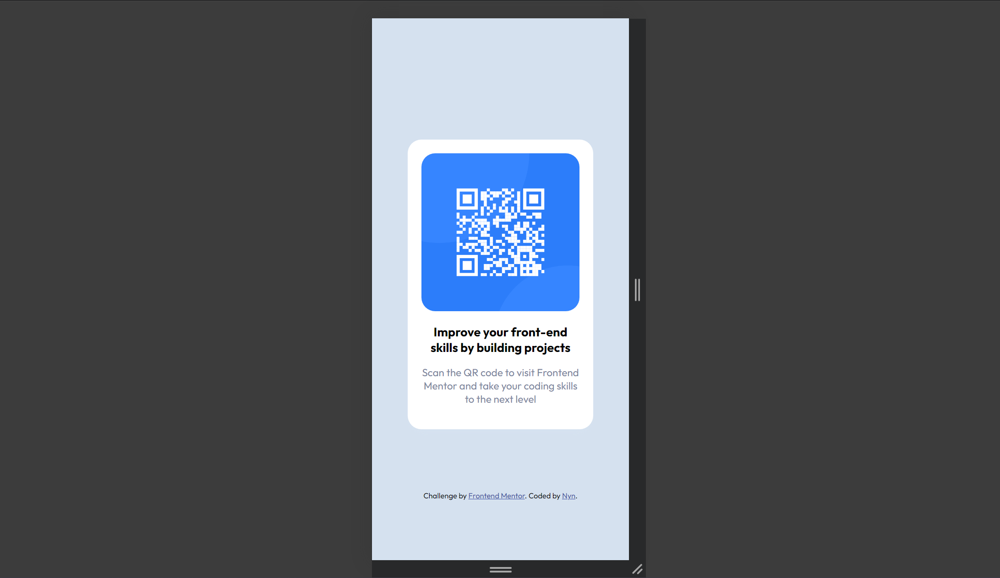

# Frontend Mentor - QR code component solution

This is a solution to the [QR code component challenge on Frontend Mentor](https://www.frontendmentor.io/challenges/qr-code-component-iux_sIO_H). Frontend Mentor challenges help you improve your coding skills by building realistic projects. 

## Table of contents

- [Overview](#overview)
  - [Screenshot](#screenshot)
  - [Links](#links)
- [My process](#my-process)
  - [Built with](#built-with)
  - [What I learned](#what-i-learned)
  - [Continued development](#continued-development)
  - [Useful resources](#useful-resources)

**Note: Delete this note and update the table of contents based on what sections you keep.**

## Overview

### Screenshot

### Links

- Solution URL: [Frontend mentor]([https://your-solution-url.com](https://www.frontendmentor.io/solutions/qrcodecomponent-oxBgbZI-2A))
- Live Site URL: [live site]([https://your-live-site-url.com](https://nyynca.github.io/QR-code-component/))

## My process

### Built with

- Semantic HTML5 markup
- CSS custom properties
- Flexbox
- [Styled Components](https://styled-components.com/) - For styles

### What I learned

I got a better understanding of flexbox but there is still a lot I need to practice.

### Continued development

I will continue practising flexbox but also how to simplfy code

### Useful resources

- [W3schools](https://www.w3schools.com/css/css3_shadows.asp) - This is an amazing article which helped me finally understand shadows. I'd recommend it to anyone still learning this concept.
